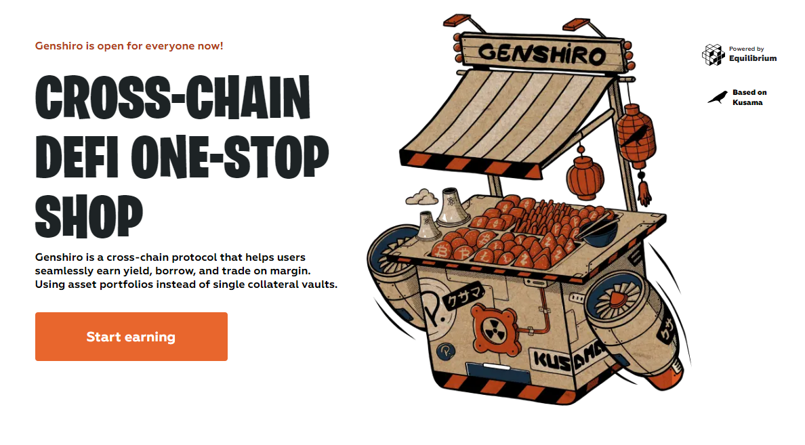

# Equilibrium & Genshiro

&nbsp&nbsp&nbsp

___

## Equilibrium is a DeFi 2.0 cross-chain money market protocol with high leverage.
With Equilibrium users can:
- Lend: lend out assets and earn interest fees. 
- Borrow: borrow assets for trading, leveraging, and hedging using portfolios of collateral.
- Trade: exchange crypto assets and trade spot markets on margin
- Insure: provide liquidity to cover potential borrower losses, and earn a yield on it
- Earn: passive income via market maker liquidity pools and liquidity farming incentives

# Equilibrium chain

See [`docs.equilibrium.io`](https://docs.equilibrium.io/)

## Overview

Equilibrium introduces the first DeFi 2.0 protocol on Polkadot with novel on-chain approach to risk and pricing for asset portfolios.
It enables borrowing with minimum collateralization as low as 105% and margin trading with up to 20X leverage.
The innovative design of Equilibrium's bailout mechanism for liquidations that is low friction and does not need auctions allows for the introduction of the first fully on-chain order book based  decentralized exchange with high leverage.

## Key features

Here is what sets Equilibrium apart from other well-known known DeFi protocols:

- There are no arbitrary governance-set interest rates. They are determined by a borrower’s portfolio, borrower debt, overall system liquidity, and the market's risks and dynamics.
- There are no arbitrarily set LTV requirements. The system makes sure every position remains solvent at a 100% collateralization ratio.
- There are no arbitrarily set liquidation penalties, and no hidden fees when borrowers default on their loan.
- Most loans in popular money markets (AAVE and Compound) are taken in major stablecoins for new investment opportunities. But users need to switch to other applications as there is no trading functionality on the initial platforms. Equilibrium solves this problem efficiently
- The Equilibrium assets module supports:
  1. asset lending;
  2. fractional reserve system and synthetic asset creation;
  3. an exchange that lets users engage in leveraged trading;
  4. portfolio hedging.

  The Assets module logic lets Equilibrium introduce a broad line of DeFi products within one blockchain, practically out of the box.
- The thought-out design of Polkadot’s consensus and finality mechanisms guarantees the security of the Equilibrium substrate on the blockchain level. Approximately 10 collators manage the Equilibrium parachain with a POA consensus and shared GRANDPA finality and blockchain security provided out of the box by Polkadot.
- Equilibrium achieves cross-chain compatibility by way of Polkadot’s integration of third party bridges to different blockchains. Ecosystem-wide interoperability is further achieved with the help of the Polkadot's XCM protocol.

# Genshiro chain

See [`docs.genshiro.io`](https://docs.genshiro.io/)

## The concept behind Genshiro

Genshiro is a cross-chain protocol that helps users seamlessly earn yield, borrow, and trade on margin. Using asset portfolios instead of single collateral vaults.

We’re concerned about simple replication of Polkadot-based technology on Kusama. Simple ports like that don’t make sense if you want to push boundaries and unlock the full potential of the DeFi market.
Equilibrium definitely wants to build something that stands out on its own Kusama-based merits while bringing value to the Kusama network and its community.

For these purposes, our Kusama-based parachain inherits an experimental spirit that’s quite common for the Kusama network.
It's a testing site for our future products before they’re deployed to Polkadot. This means we get to implement some new features for future iterations of Genshiro, like derivatives, perpetual swaps, and futures contracts on gold, ETFs, commodities, and stocks.

With a bolder set of parameters and listed assets Genshiro will be an attractive toolset to those traders who take more risk in their operations.

## Key Features

For experienced Polkadot developers, the difference in making the leap to Kusama is primarily in adjusting system parameters.
Genshiro offers a lower minimum collateralization ratio that introduces way more flexibility for leveraging and margin trading.

Genshiro is more generally accessible than our Polkadot’s platform because it supports numerous ERC-20 / BEP-20 tokens already.
Generally speaking we are less selective in picking assets for our Kusama-based product line rather than for Polkadot, where only low-volatile and popular cryptocurrencies will be added.

Another innovative element here is Genshiro’s governance model. It works by letting users stake GENS (Genshiro’s Kusama-based utility token) to propose and vote on new system parameters. The longer a user’s funds have been staked, the more weight their vote gets on the proposal.

## GENS Tokenomics

Just like its older brother, EQ token of Equilibrium, Kusama-based GENS token functions as a multipurpose token within the Genshiro system.
In particular, GENS plays a role of internal currency of Genshiro in several system components:

- GENS token is a governance token that allows its holders to express their opinions about the system state and enforce governance decisions via referendums;
- Validators/Collators receive rewards in GENS token for running blockchain nodes and performing parallel (e.g off-chain) work;
- Users pay transaction fees in GENS tokens;
- Borrowers pay interest fees in GENS tokens;
- System distributes rewards in GENS tokens for liquidity that users bring;
- GENS can be used as bailout and collateral liquidity in Kusama-based liquidity pools once tokens obtain value.

We’re excited to see where we can go with Equilibrium and Genshiro beyond Kusama and Polkadot. All told, our mission is to unlock the full potential of the DeFi market.
This calls for a holistic approach that goes beyond embracing just one platform.
